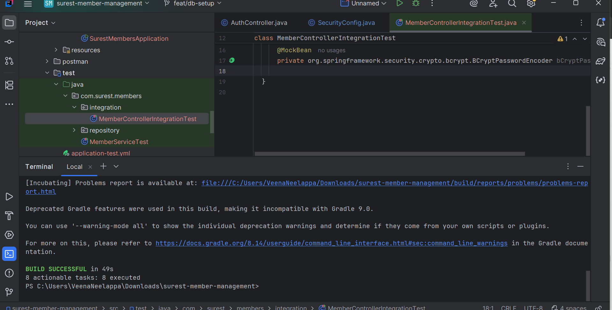
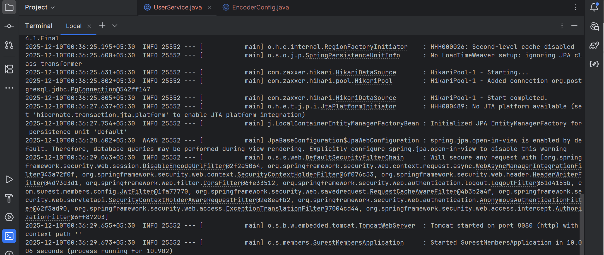
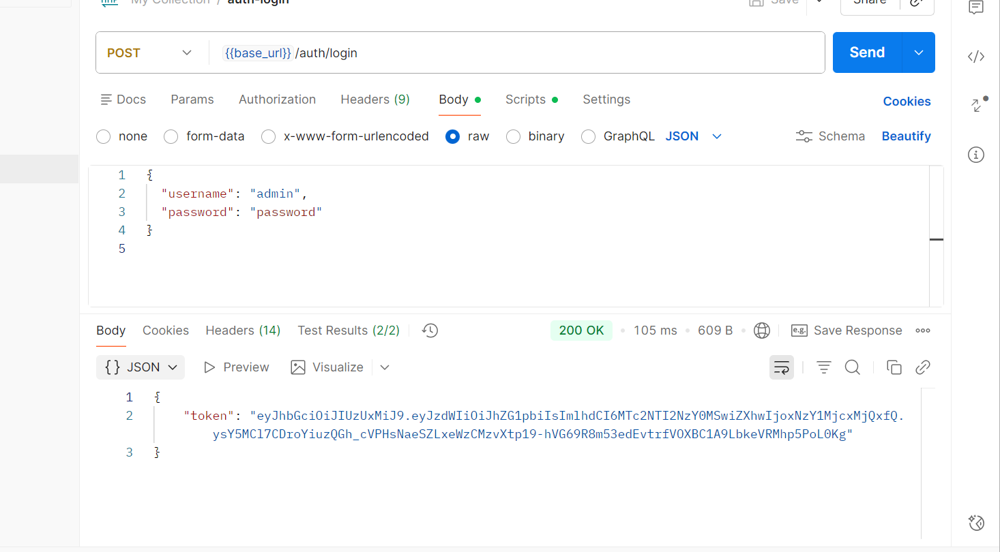
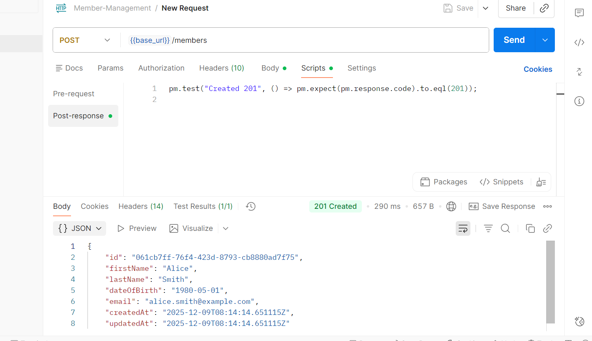
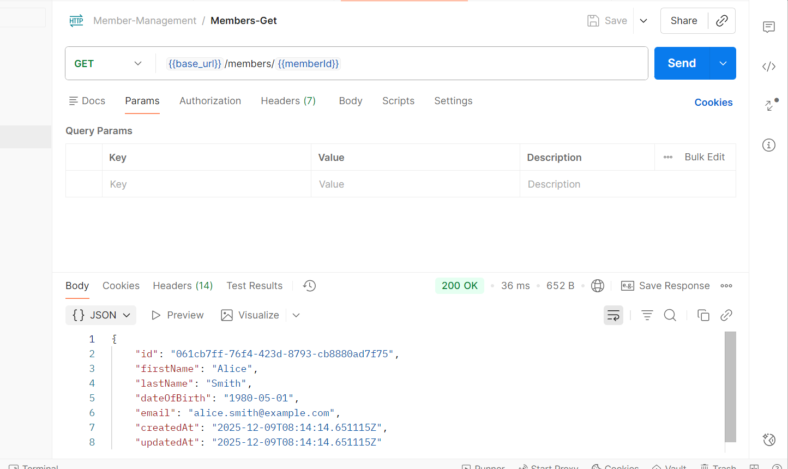
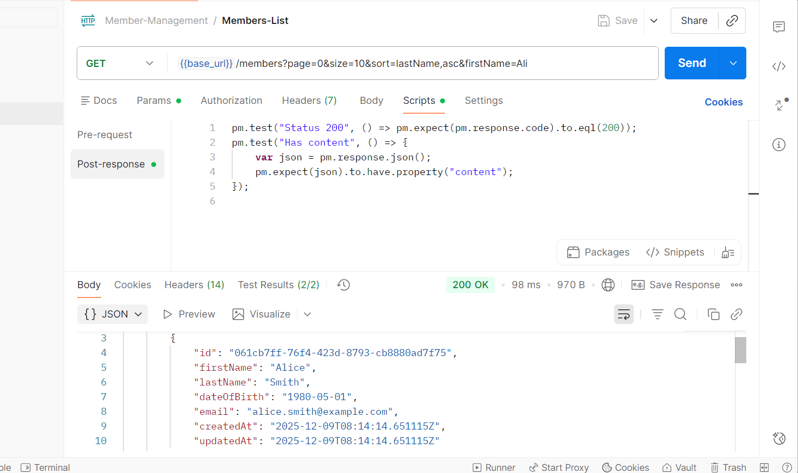
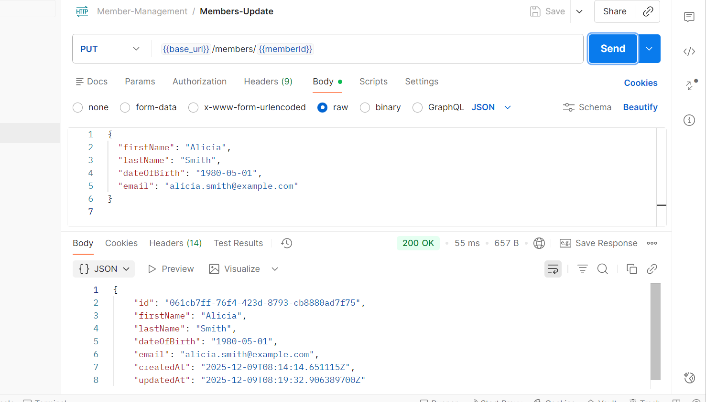
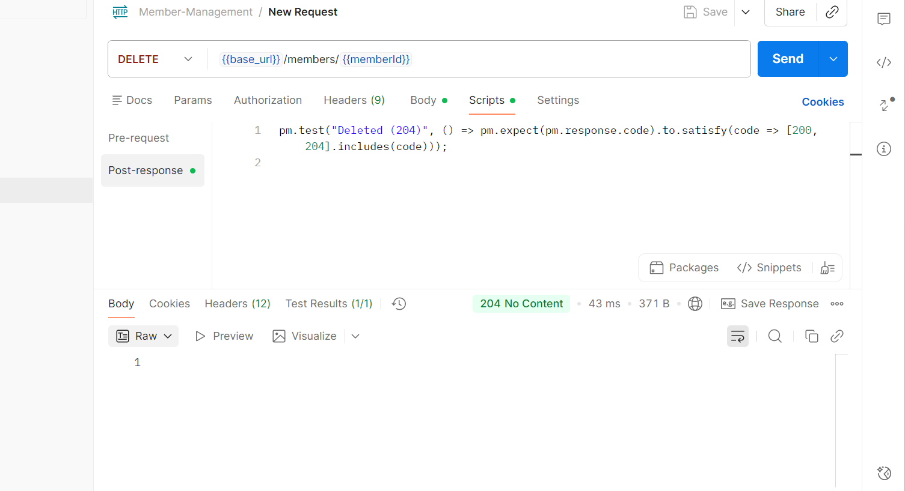

# Surest Member Management

A Spring Boot application for managing members with JWT authentication, role-based access, pagination, caching, and PostgreSQL database.

---

## 🚀 Features
- Member CRUD (Admin only)
- Member read with pagination, filtering, caching
- JWT Authentication (Login endpoint)
- Role-based security (ADMIN / USER)
- Flyway DB migrations
- Integration & unit tests with JUnit + Mockito
- Gradle build
- Docker + PostgreSQL support

---

## 🛠️ Tech Stack
- Java 17
- Spring Boot 3
- Spring Security 6
- PostgreSQL
- Flyway
- Spring Data JPA
- JUnit / Mockito
- Docker Compose

---

Project Setup:
• Used Spring Boot as the framework.
• Used PostgreSQL as the database.
• Used Gradle as the build tool.
• Configured Spring Data JPA for database access.
• Used Flyway for database migration.
• Used Spring Security with JWT for authentication.

Testing:
• Written unit tests using JUnit 5.
• Used Mockito for mocking dependencies.
• Generated a JaCoCo coverage report.
• Ensured >80% code coverage across service  and controller  layers.

Additional:
• Added Global exception Handler with meaningful messages
• Added custom Business exceptions with meaningful messages.

## Test Coverage Report

---

## Build Screenshots

---

## Postman Screenshots

### Token Generation

### Create Member (POST)

### Get Member by ID

### Get Members

### Update Member

### Delete Member

